# We Serve Your City — Organizational Chart

**Legal name:** We Serve Your City
**Doing business as:** Citizens Coffee & Catering
**Location:** Houston, TX
**Contact:** (855) 227-3783 · <nakia@weserveyourcity.org>
**Version:** 1.0 · **Last updated:** August 2026

> Placeholders marked `[TBD]` need names filled in. `[OPEN]` marks currently vacant positions. Update the version + date whenever this file changes.

---

## Visual Chart

```mermaid
flowchart TD
    Board["Board of Directors"]
    ED["Executive Director / Founder<br/>Nakia Kelley"]

    Board --> ED

    ED --> Programs["Programs"]
    ED --> Ops["Operations"]
    ED --> Finance["Finance & Administration"]
    ED --> Dev["Development & Fundraising"]
    ED --> Mktg["Marketing & Communications"]

    %% Programs
    Programs --> CCC["Citizens Coffee & Catering<br/>Program Lead — [TBD]"]
    Programs --> Community["Community Programs<br/>[OPEN]"]

    CCC --> Chef["Executive Chef / Culinary Lead — [TBD]"]
    CCC --> Cater["Catering Coordinator — [TBD]"]
    CCC --> GnG["Grab & Go Program Manager — [TBD]"]
    CCC --> Coffee["Coffee Program Lead — [TBD]"]

    Chef --> Sous["Sous Chef — [TBD]"]
    Chef --> Line["Line Cooks — [TBD]"]
    Chef --> Prep["Prep Team — [TBD]"]

    Cater --> Captains["Event Captains — [TBD]"]
    Cater --> Service["Service Staff — [TBD]"]

    GnG --> Production["Production Team — [TBD]"]
    GnG --> Delivery["Delivery / Logistics — [TBD]"]

    Coffee --> Baristas["Baristas — [TBD]"]

    Community --> Workforce["Workforce Development — [TBD]"]
    Community --> FoodAccess["Food Access / Food Rescue — [TBD]"]
    Community --> Partners["Community Partnerships — [TBD]"]

    %% Operations
    Ops --> OpsMgr["Operations Manager — [TBD]"]
    Ops --> Facilities["Facilities & Kitchen Maintenance — [TBD]"]
    Ops --> Inventory["Inventory & Purchasing — [TBD]"]
    Ops --> Safety["Food Safety & Compliance — [TBD]"]

    %% Finance
    Finance --> Controller["Finance Director / Controller — [TBD]"]
    Finance --> Books["Bookkeeping — [TBD]"]
    Finance --> HR["Payroll & HR — [TBD]"]
    Finance --> IT["IT & Systems — [TBD]"]

    %% Development
    Dev --> DevDir["Development Director — [TBD]"]
    Dev --> Grants["Grants Manager — [TBD]"]
    Dev --> Giving["Individual Giving — [TBD]"]
    Dev --> Corp["Corporate & Foundation Partnerships — [TBD]"]

    %% Marketing
    Mktg --> MktLead["Marketing Lead — [TBD]"]
    Mktg --> Social["Social Media & Content — [TBD]"]
    Mktg --> Sales["Sales / Corporate Accounts — [TBD]"]
    Mktg --> Outreach["Community Outreach — [TBD]"]

    classDef filled fill:#e8f0fe,stroke:#1a73e8,color:#111;
    classDef open fill:#fff4e5,stroke:#e8710a,color:#111;
    class ED filled;
    class Community open;
```

---

## Board of Directors

| Role | Name |
|---|---|
| Board Chair | [TBD] |
| Vice Chair | [TBD] |
| Treasurer | [TBD] |
| Secretary | [TBD] |
| Directors-at-Large | [TBD] |

---

## Executive

| Role | Name |
|---|---|
| Executive Director / Founder | Nakia Kelley |

---

## Programs

### Citizens Coffee & Catering
- **Program Lead:** [TBD]
- **Executive Chef / Culinary Lead:** [TBD]
  - Sous Chef — [TBD]
  - Line Cooks — [TBD]
  - Prep Team — [TBD]
- **Catering Coordinator:** [TBD]
  - Event Captains — [TBD]
  - Service Staff — [TBD]
- **Grab & Go Program Manager:** [TBD]
  - Production Team — [TBD]
  - Delivery / Logistics — [TBD]
- **Coffee Program Lead:** [TBD]
  - Baristas — [TBD]

### Community Programs *(open)*
- Workforce Development — [TBD]
- Food Access / Food Rescue — [TBD]
- Community Partnerships — [TBD]

---

## Operations
- Operations Manager — [TBD]
- Facilities & Kitchen Maintenance — [TBD]
- Inventory & Purchasing — [TBD]
- Food Safety & Compliance — [TBD]

## Finance & Administration
- Finance Director / Controller — [TBD]
- Bookkeeping — [TBD]
- Payroll & HR — [TBD]
- IT & Systems — [TBD]

## Development & Fundraising
- Development Director — [TBD]
- Grants Manager — [TBD]
- Individual Giving — [TBD]
- Corporate & Foundation Partnerships — [TBD]

## Marketing & Communications
- Marketing Lead — [TBD]
- Social Media & Content — [TBD]
- Sales / Corporate Accounts — [TBD]
- Community Outreach — [TBD]

---

## Advisors & Contracted Support
- Legal Counsel — [TBD]
- Accountant / CPA — [TBD]
- Insurance / Risk — [TBD]
- Advisory Board Members — [TBD]

---

## Revision History

| Version | Date | Notes |
|---|---|---|
| 1.0 | August 2026 | Initial scaffold created — placeholders only |
